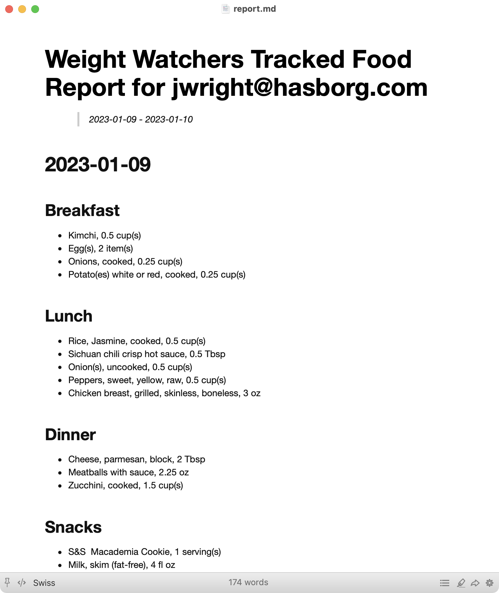

# Weight Watchers Tracked Foods Report

> :warning: **Intended for Power Users and Developers**: This script is intended for power users and developers who are comfortable working at the command line.


I've been using Weight Watchers for a few weeks, and I wanted to export the data on tracked foods to a report.
The weightwatchers.com website doesn't offer a function to export the data, but they have an undocumented API that is straightforward to use.

This script takes a start date, and end date, and the weightwatchers.com JWT as command-line arguments, and displays a [Markdown-styled report](https://www.markdownguide.org/getting-started/) of the tracked foods organized by date>breakfast|lunch|dinner|snacks.
You can use this script to generate a report of the foods you've tracked as a simple text file, or as a Markdown-rendered report using any [Markdown editor](https://www.oberlo.com/blog/markdown-editors).



## Usage

Using [Python](https://www.python.org/), run the `wwtracked.py` script, specifying a start date and an end date and the email address to login to the Weight Watchers website.
The dates must be in the format YYYY-MM-DD.
The script will interactively prompt you for your password.

> :information_source: **NOTE:** To collect your Weight Watchers data, you must supply a way to authenticate to the Weight Watchers website.
> This can be with your website email address (`-E`) and interactively entering your password when prompted, or by specifying a Java Web Token (JWT) after logging in with your browser normally.
> For more information on using a JWT for authentication, see [AUTHJWT.md](https://github.com/joswr1ght/wwtracked/blob/main/AUTHJWT.md).


### Creating a Report

Run `wwtracked.py`, specifying the desired date range and your email address:

```
$ python wwtracked.py -s 2022-12-20 -e 2022-12-30 -E youremail@address.tld
```

The `wwtracked.py` script will retrieve the meal information for the specified date range, formatting it as a simple Markdown report.
If you want to save this to a file, redirect the output to a file:

```
$ python wwtracked.py 2022-12-20 2022-12-30 -E youremail@address.tld > myreport.md
```

Then you can open `myreport.md` in a text editor or a Markdown editor to get a formatted report.


### Getting Nutritional Information

Run `wwtracked.py`, specifying the desired date range, email/JWT, and add the argument '--nutrition':

```
$ python wwtracked.py -s 2022-12-20 -e 2022-12-30 --email user@example.com --nutrition
```

After the `wwtracked.py` script creates the Markdown report of tracked food, the nutritional data will then be saved to a CSV file.


## Contributors

Thank you for code and documentation contributions!

<a href="https://github.com/joswr1ght/wwtracked/graphs/contributors">
  
</a>


## Questions/Comments/Concerns

Drop me a note jwright[at]willhackforsushi.com, or [open a ticket](https://github.com/joswr1ght/wwtracked/issues).
