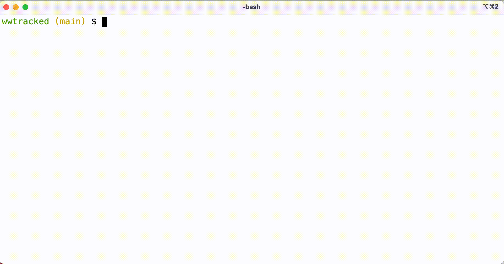
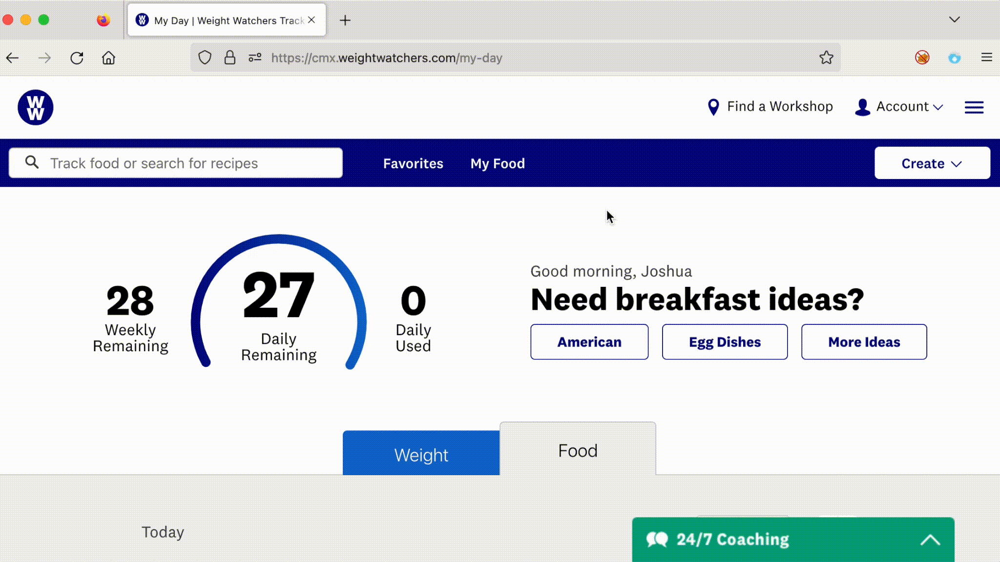

# Weight Watchers Tracked Foods Report

> :warning: **Intended for Power Users and Developers**: This script is intended for power users and developers who are comfortable working at the command line.


I've been using Weight Watchers for a few weeks, and I wanted to export the data on tracked foods to a report.
The weightwatchers.com website doesn't offer a function to export the data, but they have an undocumented API that is straightforward to use.

This script takes a start date, and end date, and the weightwatchers.com JWT as command-line arguments, and displays a Markdown-styled report of the tracked foods organized by date>breakfast|lunch|dinner|snacks.
You can use this script to generate a report of the foods you've tracked as a simple text file, or as a Markdown-rendered report using any [Markdown editor](https://www.oberlo.com/blog/markdown-editors).



## Usage

Using [Python](https://www.python.org/), run the `wwtracked.py` script, specifying a start date and an end date.
The dates must be in the format YYYY-MM-DD (with or without leading zeros).

You must also specify your Weight Watchers Java Web Token (JWT) as the third command-line argument.
In the GIF example I include the JWT as a shell variable using `$JWT`.

### Getting the JWT

To get the JWT you can use Firefox and the browser tools:

* From Firefox, navigate to the [www.weightwatchers.com](https://www.weightwatchers.com) website and login
* Right-click in the browser window and select Inspect
* Navigate to the Network tab at the top of the inspector window
* Click the Refresh button to record network information
* Click on any network request for https://cmx.weightwatchers.com (click in the Domain column)
* Scroll to the section labeled _Request Headers_
* Right-click the Authorization header and select _Copy Value_; this will place the JWT value in your clipboard

Here's an example:




### Creating a Report

Run `wwtracked.py`, specifying the desired date range and the JWT:

```
$ python wwtracked.py 2022-12-20 2022-12-30 "Bearer eyJ0eX...zqdVwoQ"
```

> Note: When pasting the JWT, you can omit the `Bearer ` prefix or include it.
> If you include the `Bearer ` prefix, make sure you paste the entire string inside quotation marks, as shown above.

The `wwtracked.py` script will retrieve the meal information for the specified date range, formatting it as a simple Markdown report.
If you want to save this to a file, redirect the output to a file:

```
$ python wwtracked.py 2022-12-20 2022-12-30 "Bearer eyJ0eX...zqdVwoQ" > myreport.md
```

Then you can open `myreport.md` in a text editor or a Markdown editor to get a formatted report.


## Questions/Comments/Concerns

Drop me a note jwright[at]willhackforsushi.com, or open a ticket.
